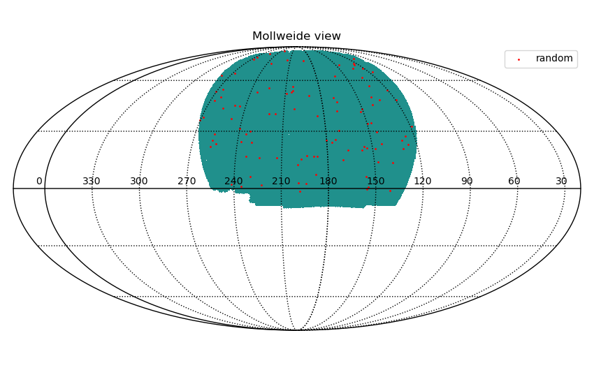
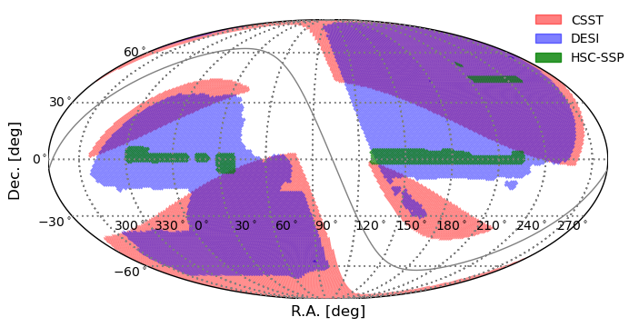
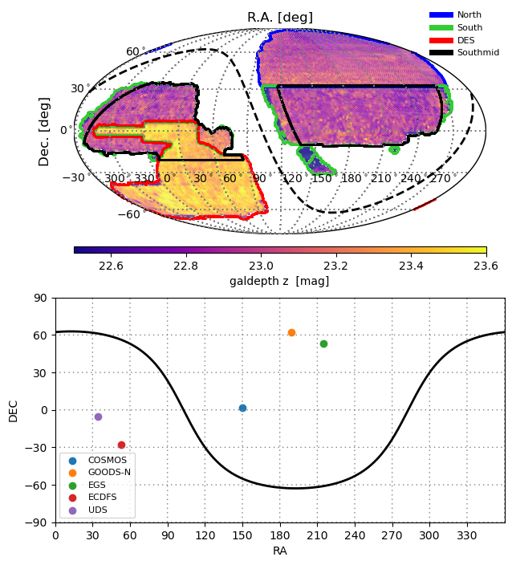
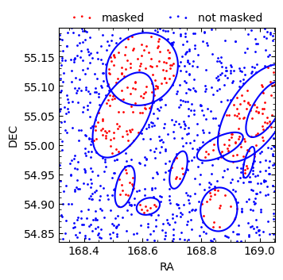

# tutorials 


###### angular selection function (module asfunc) 

<details><summary><b>  survey geometry & random sample </b> </summary>
<p>



``` python
import numpy as np
import healpy as hp
import matplotlib.pyplot as plt
import csstmock.asfunc as asfunc 

vetomap, nside = asfunc.skycov_healpy('lsdr9-ngc')

# generate random sample inside the pix 
pix     = np.arange(12*nside*nside)
pix_ngc = pix[vetomap>0]
lon, lat, skycov = asfunc.sphrand_healpy(100, nside, pix_ngc)

# plot 
vetomap[vetomap <= 0] = -np.inf # to make other region blank when plot. 
hp.mollview(vetomap, rot = [200, 0, 0], cbar = False)
hp.projscatter(lon, lat, s = 1, color = 'r', lonlat = True, label = 'random')
for lon in range(0, 360, 30): hp.projtext(lon+6, 0+2, lon, lonlat = True) 

hp.graticule()
plt.legend()
plt.show() 
``` 
</p>
</details> 


<details><summary><b>  survey geometry (The demonstration 1 of sky coverage; old) </b> </summary>
<p>

Since the basemap is deprecated, I am trying to update it using cartopy.  

Features: 
1. generate a new class inheriting axes class of matplotlib so that it is easy to fine-tune and add some new patches. (**Requirements!!! Basemap, matplotlib<=3.4**)
2. hpviewer function is written to plot the healpix map.  



``` python 
# demo 1
from csstmock import asfunc 
import numpy as np 
import healpy as hp 

#------- start the module for visual 

import matplotlib.pyplot as plt 
from csstmock.asfunc.visual_old import visual, pix2border, add_colorbar
fig, ax = plt.subplots(1,1,figsize = (8,4))
m = visual(ax = ax).moll(lon_0 = 100) # use moll projection 
m.set_parallels(shift = 0)   # parallels without ticklabel shift
m.set_meridians(shift = -38) # meridians with ticklabel shift -30 degree
m.set_galactic(b0 = 0, color = 'gray', lw = 1) # draw galatic plane 

survey_available =   ['csstv0', 'desidr9', 'hscdr3']
for ith, survey in enumerate(survey_available): 

#--- read the embedding map of sky coverage of the survey
    wht, nside = asfunc.skycov_healpy(survey)
    pix = np.arange(12*nside*nside) 
    pix = pix[wht==1.0]

#--- convert to lower resolutions to speed up 
    a, d= hp.pix2ang(nside, pix, lonlat = True) 
    nside = 64; wht = np.zeros(12*nside*nside) + np.nan 
    pix = hp.ang2pix(nside, a, d, lonlat = True) 
    pix = np.unique(pix); wht[pix] = 1.0 

#--- draw the sky coverage 
    if survey == 'csstv0': m.hpviewer(wht, npt = 1,  facecolor = 'r', alpha = 0.5) #, edgecolor = 'None') 
    if survey == 'desidr9':m.hpviewer(wht, npt = 1,  facecolor = 'b', alpha = 0.5) #, edgecolor = 'None') 
    if survey == 'hscdr3': m.hpviewer(wht, npt = 1,  facecolor = 'g', alpha = 0.8) #, edgecolor = 'None') 

#------- end the module for visual 


#--- add label, title, legend or colorbar by yourself 
ax.fill_between([0,1], [-1000,-1000], [1000,1000], color = 'r', alpha = 0.5, label = 'CSST' )
ax.fill_between([0,1], [-1000,-1000], [1000,1000], color = 'b', alpha = 0.5, label = 'DESI' )
ax.fill_between([0,1], [-1000,-1000], [1000,1000], color = 'g', alpha = 0.8, label = 'HSC-SSP' )

ax.legend(frameon=False, bbox_to_anchor=(0.85, 0.8) ) 
ax.set_xlabel('R.A. [deg]', fontsize = 12)
ax.set_ylabel('Dec. [deg]', labelpad = 20, fontsize = 12)
plt.savefig('skycov.png')

plt.show()
plt.close() 
``` 
</p>
</details>

<details><summary><b>  survey geometry (The demonstration 2 of sky coverage; old) </b> </summary>
<p>



``` python 
# demo 2 

import numpy as np 
import healpy as hp 
import matplotlib.pyplot as plt 
from csstmock.asfunc.visual_old import visual, pix2border, add_colorbar

val = np.load('healpy256/dr9-galdepth-z.npy') 
nside = 256; pix = np.arange(12*nside*nside)

#--- convert to lower resolutions to speed up 
nside = 64 
val   = hp.ud_grade(val, nside_out = nside, pess = True) 
val[val < -1E30] = np.nan 

deepfield = ['COSMOS', 'GOODS-N', 'EGS', 'ECDFS', 'UDS']
alpha     = [    150.,      189.,  215.,     53.,   34.]
delta     = [      2.,       62.,   53.,    -28.,   -5.]

fig, axs = plt.subplots(2,1,figsize = (8,8))
m0 = visual(ax = axs[0]).moll(lon_0 = 118.5)
m1 = visual(ax = axs[1]).cyl()
#------ plot left  panel 
m = m0 
m.set_parallels(shift =   0)
m.set_meridians(shift = -38)
m.set_galactic(b0 = 0, color = 'k', lw = 2, ls = 'dashed')
m.hpviewer(val, npt = 1,  cmap=plt.get_cmap('plasma'), vmin = 22.5, vmax = 23.6)

names  = ['North', 'South', 'DES', 'Southmid']
colors = ['b', 'limegreen', 'r', 'k']

for ii in range(4): 
    ipix  = np.loadtxt('healpy256/'+names[ii]+'.txt').astype('int64')
    nside = 256; val = np.zeros(12*nside*nside)
    ipix_edge = pix2border(nside, ipix, nest = True )
    a, d = hp.pix2ang(nside, ipix_edge, nest = True, lonlat = True)
    m.scatter(a, d, color = colors[ii], s = 1 ) 
    axs[0].plot([0,0], [-1000,-1000], color = colors[ii], lw = 5, label = names[ii] )
    
#--- convert to lower resolutions to speed up 
    ipix_edge = hp.nest2ring(nside, ipix_edge)
    val[ipix_edge] = 1.0
    nside = 32  
    val   = hp.ud_grade(val, nside_out = nside, pess = False) 
    val[val==0] = np.nan; 
    m.hpviewer(val, npt=1, facecolor = colors[ii]) 

#--- add label, title, legend or colorbar by yourself 
axs[0].legend(frameon=False, bbox_to_anchor=(0.85, 0.82), fontsize = 8 ) 
ticks = [22.6, 22.8, 23.0, 23.2, 23.4, 23.6]; label = 'galdepth z  [mag]'
vmin  = 22.5; vmax = 23.6; cmap = plt.get_cmap('plasma')
add_colorbar(axs[0], label, ticks, vmin, vmax, cmap, position = "bottom")
axs[0].set_title('R.A. [deg]', fontsize = 12)
axs[0].set_ylabel('Dec. [deg]', labelpad = 20, fontsize = 12)

#------ plot bottom panel 
m = m1
m.set_galactic(b0 = 0, color = 'k', lw = 2, ls = 'solid')
for a,d,label in zip(alpha, delta, deepfield): m.scatter(a, d, label = label)
axs[1].legend(fontsize = 8) 

plt.show() 
``` 

</p>
</details>

<details><summary><b>  foreground masking </b> </summary>
<p>



``` python 
import numpy as np
import matplotlib.pyplot as plt
import csstmock.asfunc as asfunc

# Randomly uniform distribution on a box of sphere
ramin  = 168.3152; ramax  = 169.0509; 
decmin = 54.8355;  decmax =  55.1990; 
ra, dec, skycov      = asfunc.sphrand_uniform(1000, ramin, ramax, decmin, decmax)

ra_mask, dec_mask, _ = asfunc.sphrand_uniform(10, ramin, ramax, decmin, decmax)
a  = np.random.uniform(0.01, 0.1, 10)
pa = np.random.uniform(0.00,  90, 10)
ba = np.random.uniform(0.30,1.00, 10)

# apply mask, return indx. if indx == True is masked; 
indx = asfunc.ellipse_masking(ra, dec, ra_mask, dec_mask, a, pa, ba) 

# figure
fig, ax = plt.subplots(1,1, figsize = (3.5, 3.5))
ax.scatter(ra[ indx], dec[ indx], s = 1, color = 'r', label = 'masked')
ax.scatter(ra[~indx], dec[~indx], s = 1, color = 'b', label = 'not masked')
for ii in range(10): 
    lon, lat = asfunc.ellipse_plot(ra_mask[ii], dec_mask[ii], a[ii], pa[ii], ba[ii], lonlat = True)
    plt.plot( lon, lat, color = 'b')
ax.set_xlim( ramin, ramax); ax.set_xlabel('RA') 
ax.set_ylim(decmin,decmax); ax.set_ylabel('DEC') 
ax.legend(frameon = False, loc = 10, bbox_to_anchor=(0.4, 0.95, 0.2, 0.2), ncol = 2, scatterpoints = 3)
plt.show() 
```
 
</p>
</details> 


<details><summary><b> fiber assignment </b> </summary>
<p> 

</p>
</details> 


###### module utils 

<details><summary><b>  2pcf </b> </summary>
<p>

</p>
</details>

###### data i/o (module dataio) 

[](jiutian_hbt.md) & [](jiutian_subfind.md)
