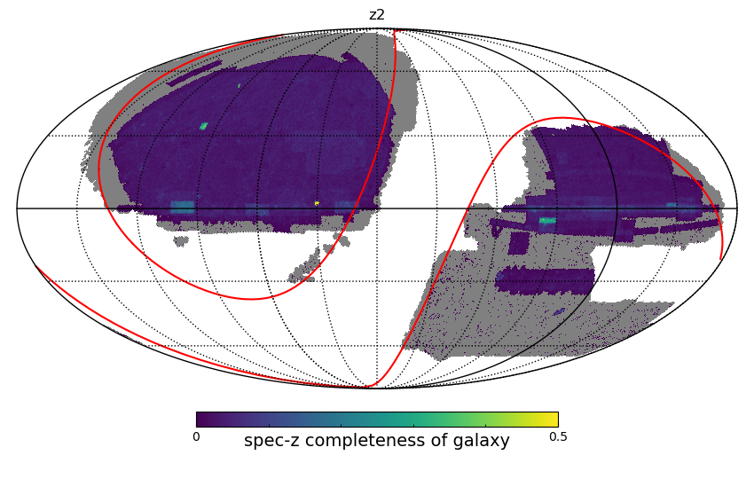
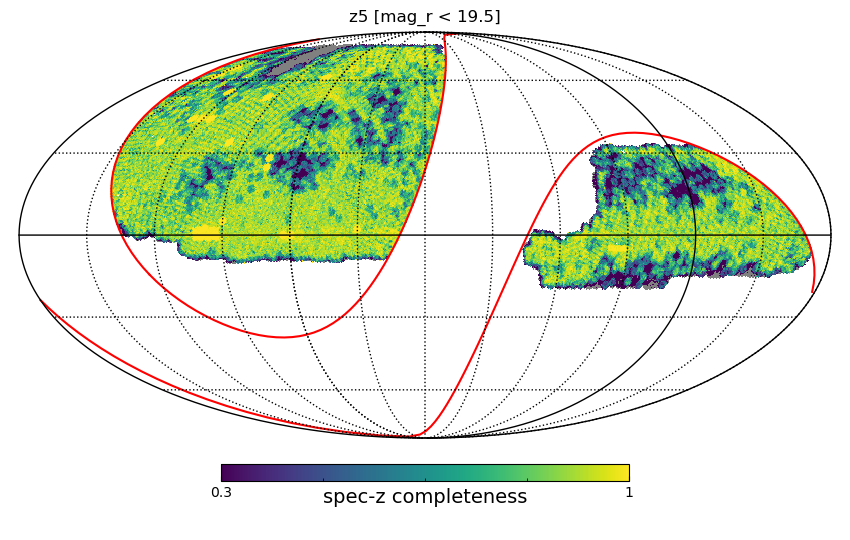

# The lsdr9-based catalog (for internal communication)

## Overall description 
We have made significant enhancements to the LSDR9-based catalog, which has a magnitude limit of 21. 

1. We have expanded the source catalog from ~140M to ~170M ([See more deteils](#selection-from-legacy-survey-dr9)).
2. The number of galaxies with spectroscopic redshifts has doubled, increasing from 10M to 20M. If you need spectroscopic data only, please see [here](#the-collections-of-desi-spectroscopic-data). 
3. We have introduced a new column, ‘tgttype’, which is used to filter out potential stars; 
4. [Coming soon!] We have refined our approach to determining stellar masses, transitioning from the method based on k-correction to the one provided by CIGALE. 

## Catalogs

**Gravity location:** /home/cossim/DESI/yzgu/seedcat/produce/*.fits 

* lsdr9_prop{[zlevel](#zlevel)}.produce.fits (~21G)-- Main Catalog of galaxy properties
 
* lsdr9_link{[zlevel](#zlevel)}.produce.fits (~11G)-- link to DESI ID and some geometry selections
* **Note:** use [zlevel](#zlevel) == 5 for the latest data of spectroscopic redshifts

### Data format of lsdr9_prop{zlevel}.fits: 

|  colname       | dtype| comments
|----------------|------|--------
| 'igal'         |   i8 | Unique id in this catalog 
| 'RA'           |   f8 | Right ascension at equinox J2000. 
| 'DEC'          |   f8 | Declination at equinox J2000. 
| 'MORPHTYPE'    |   S3 | Morphological types: "PSF", "REX", "DEV", "EXP", and "SER", which are procedured by the fitting of The Tractor. 
| 'z'            |   f8 | Redshift (PHOTZ or SPECZ). 
| 'zerr'         |   f8 | Error of redshift. 0.0001 is settled for 'non DESI-SPECZ' 
| 'zsrc'         |   i4 | Source of redshift: 0=='PHOTZ', 1 or 2 ='non DESI-SPECZ', 3,4,5='DESI-SPECZ'  
| 'tgttype'      |   S7 | Target type: 'GALAXY', 'QSO', or 'STAR'; judgments depend on spectra or colors.
| 'mstar'        |   f8 | Stellar mass from K-correction (unit: Msun/h). 
| 'mag_X'        |   f8 | Apparent magnitude, mag_X = 22.5 - 2.5log10(FLUX_X/MW_TRANSMISION_X). 
| 'kcorr_X_0.5'  |   f8 | kcorrect to z = 0.5, X = {g,r,z,w1,w2}. 
| 'usebits'      |   i8 | set usebits == 0 to reject abnormal targets and masked sources.  


The description of  **usebits**: 

|   Bit Name     | bit number| Description (=0)
|----------------|-----------|------------------------------
| 'qualitycut'   |    0      |  to select FRACFLUX_X < 0.5, FRACIN_X > 0.3, FRACMASKED_X < 0.4, for all X = {g, r, z}
| 'maskbits'     |    1      |  to reject bits of MASKBIT 1,5,6,7,8,9,11,12,13
| 'bizarrecolor' |    2      |  to select (−1 < g − r < 4)&(−1 < r − z < 4)
| 'redshift'     |    3      |  to select (FLUX_X > 0, for all X = {g, r, z, w1, w2}) or (SPEC-Z it is)
| 'foreground'   |    4      |  Not masked by bright star, median star, Globular Clusters, Planetary Nebulae, and local large galaxies. 

### Data format of lsdr9_link{zlevel}.fits: 

|  colname       | dtype| comments
|----------------|------|--------
|    igal        | int  | Unique ID [0-...]
|    release     | int  | the record of processing run; A unique identifier is release,brickid,objid. 
|    brickid     | int  | brick ID [1,662174], encoding the brick sky position; 
|    objid       | int  | catalog object number within this brick; 
|    targetid    | int64| Unique ID of spectroscopic targets; if not DESI targets, -99. 
|    regionid    | int  | 1, north_ngc; 2, south_ngc; 3, two tails; 4, south_sgc; 
|    isin_desi   | int  | 1, located in the DESI spectroscopic survey; 0, not in.  
|    iseed       | int  | the id in the old version of seedcat [0,138315648]. If not, -99.  
|    iseed_psf   | int  | the PSF-type supplyments of the seed catalog, starting with 138315649.


### zlevel


| PRODNAME   | zlevel | spec-z fraction | comments 
|------------|--------|-----------------|---------
| PRLSdr9    |  0     | 0.00%            | pure photo-z from PRLSdr9
| sweepfile  |  1     | 1.66%            | spec-z collected by Zhou et al. 2021
| 4LRGC      |  2     | 1.71%            | spec-z from low redshift group catalogs collected by lim et al. 2017
| fuji       |  3     | 2.03%            | spec-z from formal desi spectroscopic data release, fuji (1%, EDR,  2M) 
| iron       |  4     | 7.27%            | spec-z from formal desi spectroscopic data release, iron (1/3, Y1, 10M) 
| iron20240409|  5    | 12.19%    | spez-z from daily data reducation of desi up to 20240409 (2/3, Y3, 20M) 


<details><summary><b> spec-z fraction of galaxy sample in the entire catalog </b> </summary>
<p>





</p>
</details> 

   
      

### USAGE

``` python 
from astropy.table import Table
t1 = Table.read('lsdr9_prop5.fits') 
t2 = Table.read('lsdr9_link5.fits') 
reject_star = t1['tgttype']!='STAR'   # select galaxy, qso; reject star 
useflag     = t1['usebits']==0 # to avoid the very unreliable redshifts and feroground masks
magr_cut    = t1['mag_r']<19.5
isin_desi   = t2['isin_desi'] ==1 # apply the region cut
indx_seed   =(t2['iseed'] >=0)  # sources in the old version of seed catalog 

# select sample
t1 = t1[reject_star&useflag&magr_cut&useflag&isin_desi&indx_seed] 

# ... make some plots

```

<details><summary><b> example plot </b> </summary>
<p>



</p>
</details> 


## The construction of the source catalog

All sources that are resolved (or extended), characterized by MORPHTYPE being either REX, DEV, EXP, or SER, are incorporated into the final catalog.
For point sources, identified by MORPHTYPE as PSF, it presents a challenge to differentiate between unresolved galaxies, stars, or distint quasars. 
Conservatively, the final catalog only includes those PSF sources that possess spectra, which have been classified into GALAXY, QSO, or STAR by Redrock.

* In one word, the catalog is constructed by **PSF(spec only)+REX+DEV+EXP+SER**

<!-- ```
              |   EXT-morph (REX, DEV, EXP, or SER)      |    PSF-morph with spec-z (PSF)    |    ALL
north_ngc     |        40,360,233 ( 5,354,511   36,181)  |  44,493,809  (  39,667   245,208) |    84,854,042
south_ngc     |        49,149,992 ( 7,801,986   27,138)  |  53,155,166  (  64,443   503,568) |   102,305,158
south_sgc     |        73,808,229 (12,407,742   18,981)  |  70,602,469  (  50,008   380,406) |   144,410,698
    total     |       163,318,454                        | 168,251,444  ( 154,118 1,129,182) |   331,569,898

* EXT-morph means that the morphological type is 'REX', 'EXP', 'DEV', or 'SER'. 
* PSF-morph means that the morphological type is 'PSF'.  
``` -->

###  The selection from legacy survey dr9

The primary selection is that: 

1. NOBS_{X} > 0, X = {g, r, z}, the object should be observed in each optical band; 
2. MORPHTYPE !=  'DUP', use the [five morphological types](https://www.legacysurvey.org/dr9/description/#morphological-classification) procedured by the fitting of [the Tractor](https://github.com/dstndstn/tractor);  MORPHTYPE == REX, DEV, EXP, SER, or PSF. 
3. apparent magnitude limits are mag_z <= 21 or mag_r <= 21; 
4. unique sources (Sources are resolved as distinct by only counting BASS and MzLS sources if they are both at Declination > 32.375° and north of the Galactic Plane, or, otherwise counting DECam sources.) 

When compared to the dataset in Yirong’s work, the following improvements are notable:

* We have expanded the catalog from having a magnitude limit of mag_z <= 21 to include objects where either mag_z <= 21 or mag_r <= 21;
* we have incorporated the targets with MORPHTYPE == 'PSF' into the catalog; 
* we have introduced a new column, ‘tgttype’, which is used to filter out potential stars; 
* we have extended the catalog to include areas near the galactic plane where |b| <= 25. 

### The collections of DESI spectroscopic data 

**Gravity location:** /home/cossim/DESI/yzgu/rawdata/release/DESItgt_specz_{SPECPROD}.fits 

Overall view of the collection of DESI spectral data:

    SPECPROD     | sci targets (  GALAXY      QSO     STAR) | comments 
    fuji         |     1712004 ( 1125635    90241   496128) | Early data (released)
    iron         |    20415123 (14179871  1645842  4589410) | Year1 data (dr1)
    iron20240409 |    44276250 (29704052  2757831 11814367) | Year3 data (latest)

Selection criteria of the unique targets: 

   1.  OBJTYPE == 'TGT', fiber positioners should point to the sci targets (star, galaxy, or qso).  
   2.  ZWARN == 0, no redshift warning from REDROCK
   3.  maximum DELTACHI2, when one unique target has more than one observation.   


<!-- ### Details 

```
                       EXT-morph     photstar specstar       PSF-morph   specgala  specqso      ALL
north_ngc     |        40,360,233 ( 5,354,511   36,181)  |  44,493,809  (  39,667   245,208) |    84,854,042
south_ngc     |        49,149,992 ( 7,801,986   27,138)  |  53,155,166  (  64,443   503,568) |   102,305,158
south_sgc     |        73,808,229 (12,407,742   18,981)  |  70,602,469  (  50,008   380,406) |   144,410,698
    total     |       163,318,454                        | 168,251,444  ( 154,118 1,129,182) |   331,569,898

* EXT-morph means that the morphological type is 'REX', 'EXP', 'DEV', or 'SER'. 
* PSF-morph means that the morphological type is 'PSF'.  
```  -->

## Known issues: 
```
    1. 'mstar' is got from 'KCORRECTv4.0', need to update to CIGALE's results, unit: log10(Mstar*h/Msun)
    2.  Random sample are needed. 
```


<!-- ```
                       EXT-morph              PSF-morph           ALL
north_ngc     |        40,360,233             44,493,809   |    84,854,042
south_ngc     |        49,149,992             53,155,166   |   102,305,158
south_sgc     |        73,808,229             70,602,469   |   144,410,698
    total     |       163,318,454            168,251,444   |   331,569,898
```  -->

<!-- 
### Data format of lsdr_shape.fits () 


### Data format of lsdr9_healpix.fits (163,665,614, on going) : 
```
    igal      float   {igal}.1, north_ngc; {igal}.2, south_ngc; {igal}.3, two tails; {igal}.4, south_sgc;   
   compl_z21  float   {igal}.1, north_ngc; {igal}.2, south_ngc; {igal}.3, two tails; {igal}.4, south_sgc;   
``` 


    lsdr9_id.fits # galaxy ids and some geometry selections
    lsdr9.z5.fits # updating catalogs of galaxy properties related to redshits 


Cutout to the seed catalog:  

    EXT morph + PSF morph with spec-z  = Total number
    138315649 +                     0  =  138,315,649 (old seed catalog)


seedcat-origin(138): origin seed catalog we used 
seedcat-extend(138): 'PSF' morphology is involved, and deeper

----------------------------------------------------------------
                    spectroscopic redshift fraction 
----------------------------------------------------------------
              seedcat-origin   seedcat-extendz21
north_ngc         31,450,384          84,116,567
south_ngc         41,237,608         102,072,629
south_sgc         65,627,657         144,023,595
    total        138,315,649         330,212,791


The the comparsion of total number can be seen as follow. 

    EXT morph + PSF morph with spec-z  = Total number
    162408108 +               1257506  =  163,665,614 (current version)
    138315649 +                     0  =  138,315,649 (old version of seed catalog)
 -->


