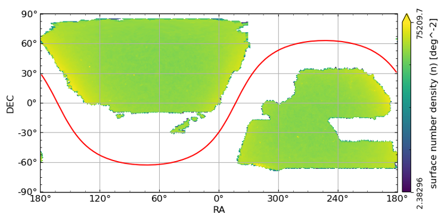
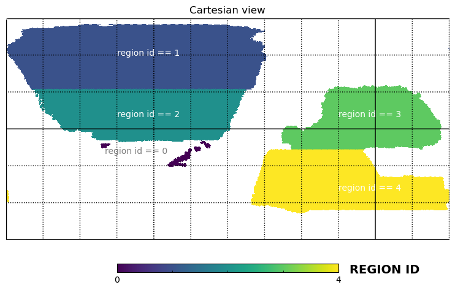

# The lsdr9-based catalog (v3)

**The galaxy catalog can be viewed at this [link](#the-list-of-galaxy-catalogs).**

#### The summary catalog 

We have reconstructed the summary catalog based on [DESI Legacy Imaging Surveys (dr9)](https://www.legacysurvey.org/dr9/description/), which has de-extinction magnitude limits of 21 on the r-band or z-band. The summary catalog covers ~20000 deg^2. It contains ~331M objects (might be star, galaxy or QSO). 

The primary selection is that: 

1. NOBS_{X} > 0, X = {g, r, z}, the object should be observed in each optical band; 
2. MORPHTYPE !=  'DUP', use the [five morphological types](https://www.legacysurvey.org/dr9/description/#morphological-classification) procedured by the fitting of [the Tractor](https://github.com/dstndstn/tractor);  MORPHTYPE == REX, DEV, EXP, SER, or PSF. 
3. apparent magnitude limits are mag_z <= 21 or mag_r <= 21; 
4. unique sources (Sources are resolved as distinct by only counting BASS and MzLS sources if they are both at Declination > 32.375° and north of the Galactic Plane, or, otherwise counting DECam sources.) 

<details><summary><b> The footprint of the sweep catalog (r<21|z<21) </b> </summary>
<p>



</p>
</details> 

<p> </p>

The total number of the objects with r < 21 or z < 21 is 331,569,898. In the actual process, the summary catalog is archived into six parts based on morphology and position, as shown in the Table.  

|folder name | number of record| id in the cutout catalogs |sum |
|------------|---------------- |-|--|
|ext_northngc| 40360233 |        0 - 40360232| ↓ 
|ext_southngc| 49149992 | 40360233 - 89510224|163318454
|ext_southsgc| 73808229 | 89510225 -163318453| ↑
||||
|psf_northngc| 44493809 |163318454 -207812262| ↓
|psf_southngc| 53155166 |207812263 -260967428|168251444
|psf_southsgc| 70602469 |260967429 -331569897| ↑
||||


* ext means that the morphological type is 'REX', 'EXP', 'DEV', or 'SER'. 
* psf means that the morphological type is 'PSF'.  
* north_ngc (b > 0 & dec > 32.375) use the filters of BASS_G, BASS_R, MZLS_Z, WISE_W1 and WISE_W2. 
* south_ngc and south_sgc use the filters of DECAM_G, DECAM_R, and DECAM_Z, WISE_W1 and WISE_W2.  

#### The galaxy sample selected from the summary catalog 

**All of the following tables can be consolidated from this sweep catalog (331,569,898 objects in total). As the spectroscopic redshift data continues to be updated, we have constructed different versions of galaxy catalogs using the following criterion.** 

<!-- <details style="padding-left: 2em;"><summary><b> Sample selection </b> </summary
<p> -->
##### Step1, The photometry source catalog with photo-z
1. Apparent magnitude limit of appz < 21
2. Foregroud mask of ["BRIGHT", "MEDIUM-bright" stars, Globular Clusters and Planetary Nebulae](https://www.legacysurvey.org/dr9/external/#toc-entry-5)
3. BITMASK != 1,5,6,7,8,9,11,13 (refer to [the DR9 bitmasks](https://www.legacysurvey.org/dr9/bitmasks/))
4. FRACFLUX_X < 0.5, FRACIN_X > 0.3, FRACMASKED_X < 0.4, for all X = {g, r, z} (refer to [the Tractor Catalog Format](https://www.legacysurvey.org/dr9/catalogs/))

Note that The majority difference are that we put local large galaxies back to the galaxy catalog, rather than masking them. 

##### Step2, Updatad to DESI spectroscopic data release
5. Updating to spez-z 
    - If spec-z from BRIGHT and DARK programs of SV3 or main survey, we use spec-z classified as GALAXY and QSO. 
    - If no spec-z, we use photo-z instead. 
6. Remove STARs in 3 different situations
    - if w/i spec, reject star using the REDROCK results of spectral fitting 
    - if w/o spec, EXT type but in gaia, reject stars using gaia - r < 0.6; 
    - if w/o spec and PSF type, reject them all. 
7. Set a lower limit of z > 0.001

<!-- </p>
</details>  -->

<p> </p>

##### The list of galaxy catalogs
* **bright galaxy catalog updated to Y3 loa:** The latest catalog updated to the loa version. In this version, we apply a brighter magnitude cut of r < 19.5 to match the BGS-BRGIHT targets in the DESI Bright Galaxy Survey. We only involve spec-z from the main galaxy sample of SDSS dr16 and from BGS-BRGIHT sample in loa. If there is no spec-z from their two sample, we use photo-z instead. 

    Gravity location: /home/yzgu/data/desi/yzgu/seedcat/data3/lsdr9_prop.bright.y3.v3.fits (.csv)

<p> </p>


##### The data format of the cutout catlogs, lsdr9_prop.*.fits

|  colname       | dtype| comments
|----------------|------|--------
| 'igal'         |   i8 | Unique id in this catalog 0-331569897 (id in the cutout catalog)
| 'RA'           |   f8 | Right ascension at equinox J2000. 
| 'DEC'          |   f8 | Declination at equinox J2000. 
| 'z'            |   f8 | Redshift (PHOTZ or SPECZ). 
| 'zerr'         |   f8 | Error of redshift. 0.0001 is settled for 'non DESI-SPECZ' 
| 'zsrc'         |   i4 | Source of redshift. 0: 'PHOTZ';1,2:'non DESI-SPECZ';>=3:'DESI-SPECZ'  
| 'lmass_kcorr'  |   f8 | log10 of Stellar mass from K-correction. Unit: $h^{-2} M_\odot $ 
| 'lmass_cigale' |   f8 | log10 of Total mass of stars from cigale. Unit: $M_\odot$; ($h=0.7$; $\Omega_M = 0.3$)
| 'lsfr_cigale'  |   f8 | log10 of star formation rate from cigale. Unit: $M_\odot/\rm year$ 
| 'ldust_cigale' |   f8 | log10 of Estimated dust luminosity from cigale using an energy balance. Unit: $L_\odot$  
| 'mag_X'        |   f8 | Apparent magnitude, mag_X = 22.5 - 2.5log10(FLUX_X/MW_TRANSMISION_X). 
| 'kcorr_X_0.5'  |   f8 | kcorrect to z = 0.5, X = {g,r,z,w1,w2}. 
| 'MORPHTYPE'    |   S3 | Morphological types: "PSF", "REX", "DEV", "EXP", and "SER". 
| 'regionid'     |   i4 | 0, two tails; 1&2: ngc; 3&4: sgc; 
| 'tgttype'      |   i4 | 0, star; 1, galaxy; 2, QSO; -1, unclassified. 

<details><summary><b> Illustration of regionid </b> </summary>
<p>



</p>
</details> 

<p> </p>

Note: In order to be more concise, I have kept only the necessary information. Additional information can be obtained through the supplementary catalogs. Contact me.  

<p> </p>
<p> </p>

#### The supplementary infomation (building)

##### lsdr9_link.*.fits

|  colname       | dtype| comments
|----------------|------|--------
| 'igal'         |   i8 | Unique id in this catalog 0-331569897 (id in the cutout catalog)
| 'RELEASE'      |   i8 | the record of processing run; A unique identifier is release,brickid,objid. 
| 'BRICKID'      |   i8 | brick ID [1,662174], encoding the sky position of brick; 
| 'OBJID'        |   i8 | catalog object number within this brick; 
| 'REGION'       |   s1 | 'N' or 'S', marking object from which sweeps catalogs, [north/sweep](https://portal.nersc.gov/cfs/cosmo/data/legacysurvey/dr9/north/sweep/) or [south/sweep](https://portal.nersc.gov/cfs/cosmo/data/legacysurvey/dr9/south/sweep/) [(subsets of Tractor catalogs)](https://www.legacysurvey.org/dr9/description/)
| 'RA'           |   f8 | Right ascension at equinox J2000
| 'DEC'          |   f8 | Declination at equinox J2000 
| 'TARGETID'     |   i8 | Unique ID of spectroscopic targets; if not DESI targets, -99. 
|    DESI_TARGET | int64| Target masks record the reasons why each target was selected for DESI observations; refer to [Target masks](https://desidatamodel.readthedocs.io/en/latest/bitmasks.html#target-masks)
|    BGS_TARGET  | int64| also refer to [Target masks](https://desidatamodel.readthedocs.io/en/latest/bitmasks.html#target-masks)
|    MWS_TARGET  | int64| also refer to [Target masks](https://desidatamodel.readthedocs.io/en/latest/bitmasks.html#target-masks)
|    SCND_TARGET | int64| also refer to [Target masks](https://desidatamodel.readthedocs.io/en/latest/bitmasks.html#target-masks)

* If you want other [Tractor photometry from lsdr9](https://www.legacysurvey.org/dr9/catalogs/#toc-entry-1),  see Please look here.

    We have a copy of [sweeps catalogs](https://www.legacysurvey.org/dr9/description/) in GRAVITY: /home/cossim/DESI/sweep/\<REGION\>/sweep-\<RAmin\>\<DECmin\>-\<RAmax\>\<DECmax>.fits
    It is easy to find the object using the following steps.  
    1. Using 'REGION' columns to local the directory, 'south' or 'north'. 
    2. Using 'RA' and 'DEC' columns to find in which file, (RAmin <= RA < RAmax)&(DECmin <= DEC < DECmax).
    3. Using 'RELEASE', 'BRICKID', 'OBJID' columns to match the object 
* If you want to know which one is selected as DESI targets, e.g., BGS, please look here. 

    It is easy to pick up the targets using the following python code. 
    1. ```DESI_TARGET & 2**0 > 0```, LRG
    2. ```DESI_TARGET & 2**1 > 0```, ELG
    3. ```DESI_TARGET & 2**2 > 0```, QSO
    4. ```DESI_TARGET & 2**60> 0```, BGS
    5. ```BGS_TARGET & 2**0 > 0```, BGS-FAINT
    5. ```BGS_TARGET & 2**1 > 0```, BGS-BRIGHT

    **Note** that these sources are DESI's observation targets, but it does not mean that these sources have already had DESI's spectral observations. See the explanation of [TRAGET MASK](https://desidatamodel.readthedocs.io/en/latest/bitmasks.html#target-masks) for more details. 

##### lsdr9_kcorr\<zz\>.*.fits <>

\<zz\> = 01, 02, 03, 04, 05, it means the catalog contain the value kcorrect to z = 0.1, 0.2, 0.3, 0.4 and 0.5. 

|  colname       | dtype| comments
|----------------|------|--------
| 'igal'         |   i8 | Unique id in this catalog 0-331569897 (id in the cutout catalog)
| 'kcorr_X'      |   f8 | X = {g,r,z,w1,w2}. 

##### lsdr9_group.*.fits 

|  colname       | dtype| comments
|----------------|------|--------
| 'igal'         |   i8 | Unique id in this catalog 0-331569897 (id in the cutout catalog)
| 'groupid'      |   i8 | groupid with b > 0 less than groupid with b < 0 (b is galactic latitude of group) 
| 'groupra'      |   f8 | Right ascension of group at equinox J2000. 
| 'groupdec'     |   f8 | Declination of group at equinox J2000 
| 'groupz'       |   f8 | Redshift of group 
| 'grouplogm'    |   f8 | 
| 'rank'         |   i8 | 0, central; >= 1, satelite. 


##### the extended halo-based group catalog

The updated version of extended halo-based group catalog based on DESI legecy Imaging Surveys DR9 and the spectroscopic data release of iron. We refer to Yang et al. (2021) for more details of the extended halo-based group finder. 

I. galaxy catalog 

    $1  igal         Unique id 
    $2  RELEASE      from LS DR9
    $3  BRICKID      from LS DR9
    $4  OBJID        from LS DR9
    $5  RA           Right ascension at equinox J2000.
    $6  DEC          Declination at equinox J2000. 
    $7  z            Redshift
    $8  zerr         Redshift Error
    $9  zsrc         Source of Redshift. 0: ‘PHOTZ’; >0: 'SPECZ'
    $10 mag_z        mag_z = 22.5 - 2.5log10(FLUX_Z/MW_TRANSMISION_Z)
    $11 korr_z_05    kcorrect to z = 0.5 

II. group properties

    $1 igrp          Unique id of group 
    $2 grp_ra        Right ascension of group 
    $3 grp_dec       Declination of group 
    $4 grp_z         redshift of group
    $5 grp_logm      the log10 of halo mass, log M/(Msun/h),  
    $6 grp_logl      the log10 of characteristic group luminosity,  log L/(Lsun/h^2) 

III. galaxy-group relationship

    $1 igal          Unique id of galaxy 
    $2 igrp          Unique id of group 
    $3 rank          0, central; >= 1, satelite. 

<!-- <details><summary><b> SED fitting using CIGALE </b> </summary>
<p>

| Key Parameters    | Configures |
|-------------------|-----------|
| SFH               |  exponentially declining
| e-folding time    | 10^8 - 10^10 yr (10 steps)
| age               | 5*10^7 - 10^10 yr (12 steps)
| SPS models        | BC03
| IMF                         | Chabrier (2003) 
| metallicity                 | 0.02 
| dust attenuation law        | Calzetti et al. (2000)
| E_BVs_young                 | 0.01-1.2 (13 steps)|
</p>
</details>  -->