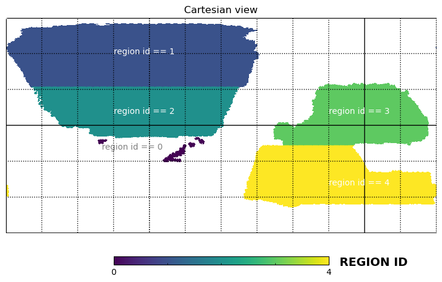

# The lsdr9-based catalog 

#### The summary catalog 

We have reconstructed the summary catalog based on [DESI Legacy Imaging Surveys (dr9)](https://www.legacysurvey.org/dr9/description/), which has de-extinction magnitude limits of 21 on the r-band or z-band. The summary catalog covers ~20000 deg^2. It contains ~331M objects (might be star, galaxy or QSO). 

The primary selection is that: 

1. NOBS_{X} > 0, X = {g, r, z}, the object should be observed in each optical band; 
2. MORPHTYPE !=  'DUP', use the [five morphological types](https://www.legacysurvey.org/dr9/description/#morphological-classification) procedured by the fitting of [the Tractor](https://github.com/dstndstn/tractor);  MORPHTYPE == REX, DEV, EXP, SER, or PSF. 
3. apparent magnitude limits are mag_z <= 21 or mag_r <= 21; 
4. unique sources (Sources are resolved as distinct by only counting BASS and MzLS sources if they are both at Declination > 32.375° and north of the Galactic Plane, or, otherwise counting DECam sources.) 

<b> The footprint of the sweep catalog (r<21|z<21>) </b> 

 

 

The total number of the objects with r < 21 or z < 21 is 331,569,898. In the actual process, the summary catalog is archived into six parts based on morphology and position, as shown in the Table.  

|folder name | number of record| id in the cutout catalogs |sum |
|------------|---------------- |-|--|
|ext_northngc| 40360233 |        0 - 40360232| ↓ 
|ext_southngc| 49149992 | 40360233 - 89510224|163318454
|ext_southsgc| 73808229 | 89510225 -163318453| ↑
||||
|psf_northngc| 44493809 |163318454 -207812262| ↓
|psf_southngc| 53155166 |207812263 -260967428|168251444
|psf_southsgc| 70602469 |260967429 -331569897| ↑
||||

* ext means that the morphological type is 'REX', 'EXP', 'DEV', or 'SER'. 
* psf means that the morphological type is 'PSF'.  
* north_ngc (b > 0 & dec > 32.375) use the filters of BASS_G, BASS_R, MZLS_Z, WISE_W1 and WISE_W2. 
* south_ngc and south_sgc use the filters of DECAM_G, DECAM_R, and DECAM_Z, WISE_W1 and WISE_W2.  

#### The cutout catlogs from the summary catalog 

**All of the following tables can be consolidated from this sweep catalog with 331,569,898 objects.** 

The latest catalog updated to the jura version: 

<b> the cutout catalog 'safe1z21z6' (reject stars strictly) </b> 

Gravity location: /home/yzgu/data/desi/yzgu/seedcat/data/lsdr9_prop.safe1z21z6.fits (.csv)

Condition:

1. appz < 21
2. lmstar_cigale > 6
3. z > 0
4. foregroud mask
5. BITMASK != 1,5,6,7,8,9,11,12,13 (refer to [the DR9 bitmasks](https://www.legacysurvey.org/dr9/bitmasks/))
6. FRACFLUX_X < 0.5, FRACIN_X > 0.3, FRACMASKED_X < 0.4, for all X = {g, r, z} (refer to [the Tractor Catalog Format](https://www.legacysurvey.org/dr9/catalogs/))
7. remove STAR
  * if w/i spec regradless EXT or PSF, reject star using the REDROCK results of spectral fitting 
  * if EXT w/o spec but w/i gaia,  reject star using gaia - r < 0.6; 
  * if EXT w/o spec and w/o gaia,  reject star using z − W1 < 0.8 × (r − z) − 0.6
  * if PSF w/o spec, reject them all. 

 

<b> the cutout catalog 'safe2z21z6'  </b> 

Gravity location: /home/yzgu/data/desi/yzgu/seedcat/data/lsdr9_prop.safe2z21z6.fits (.csv)

Condition: 

1. appz < 21
2. lmstar_cigale > 6
3. z > 0
4. foregroud mask
5. BITMASK != 1,5,6,7,8,9,11,12,13 (refer to [the DR9 bitmasks](https://www.legacysurvey.org/dr9/bitmasks/))
6. FRACFLUX_X < 0.5, FRACIN_X > 0.3, FRACMASKED_X < 0.4, for all X = {g, r, z} (refer to [the Tractor Catalog Format](https://www.legacysurvey.org/dr9/catalogs/))
7. remove STAR
  * if w/i spec regradless EXT or PSF, reject star using the REDROCK results of spectral fitting 
  * if EXT w/o spec but w/i gaia,  reject star using gaia - r < 0.6; 
  * <del> if EXT w/o spec and w/o gaia, reject using z − W1 < 0.8 × (r − z) − 0.6</del>
  * if PSF w/o spec, reject them all. 

 

 

Note: In this version, we only use the archive spec-z collected by Zhou et al. 2021 and the DESI spec-z released in jura. 

##### The Data format of the cutout catlogs

|  colname       | dtype| comments
|----------------|------|--------
| 'igal'         |   i8 | Unique id in this catalog 0-331569897 (id in the cutout catalog)
| 'RA'           |   f8 | Right ascension at equinox J2000. 
| 'DEC'          |   f8 | Declination at equinox J2000. 
| 'z'            |   f8 | Redshift (PHOTZ or SPECZ). 
| 'zerr'         |   f8 | Error of redshift. 0.0001 is settled for 'non DESI-SPECZ' 
| 'zsrc'         |   i4 | Source of redshift. 0: 'PHOTZ';1,2:'non DESI-SPECZ';>=3:'DESI-SPECZ'  
| 'lmstar_kcorr' |   f8 | Stellar mass from K-correction. Unit: $h^{-2} M_\odot $ 
| 'lmstar_cigale'|   f8 | Total mass of stars from cigale. Unit: $h^{-2} M_\odot $ 
| 'lsfr_cigale'  |   f8 | Instantaneous star formation rate from cigale. Unit: $h^{-2} M_\odot/\rm year$ 
| 'ldust_cigale' |   f8 | Estimated dust luminosity from cigale using an energy balance. Unit: $h^{-2} L_\odot$  
| 'mag_X'        |   f8 | Apparent magnitude, mag_X = 22.5 - 2.5log10(FLUX_X/MW_TRANSMISION_X). 
| 'kcorr_X_0.5'  |   f8 | kcorrect to z = 0.5, X = {g,r,z,w1,w2}. 
| 'MORPHTYPE'    |   S3 | Morphological types: "PSF", "REX", "DEV", "EXP", and "SER". 
| 'regionid'     |   i4 | 0, two tails; 1&2: ngc; 3&4: sgc; 
| 'tgttype'      |   i4 | 0, star; 1, galaxy; 2, QSO; -1, unclassified. 

<b> Illustration of regionid </b> 

 

Note: In order to be more concise, I have kept only the necessary information. Additional information can be obtained through the supplementary catalogs. Contact me.  

 

 

